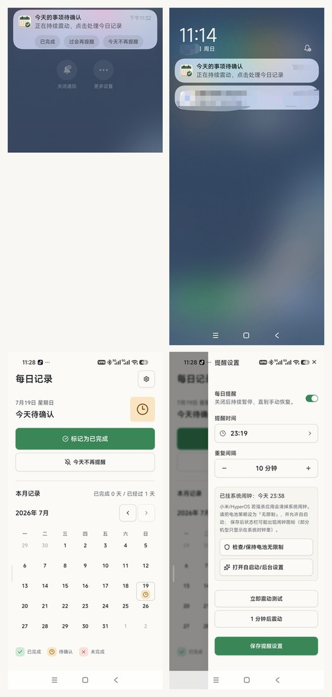

# 每日记录 (Daily Record)

本机优先的 Android 每日确认工具。用一句话回答：今天这件事做了没有。

默认对外文案保持中性（「每日记录」），不在启动器名称、图标和系统通知里暴露具体事项内容。


## 截图



## 功能

- 今日状态一眼可见：待确认 / 已完成 / 未完成
- 月历回看与修改历史记录
- 本地可配置每日提醒时间与重复间隔
- Android 原生精确闹钟 + 前台持续震动提醒
- 通知动作：已完成 / 过会再提醒 / 今天不再提醒
- 数据只保存在本机，无账号、无云同步

## 技术栈

- React + Vite + TypeScript + Tailwind / shadcn
- Capacitor 8 (Android)
- 原生 AlarmManager + Foreground Service 负责可靠提醒

## 本地开发

### 环境

- Node.js 20+
- pnpm
- Android SDK + JDK 17/21

### 网页端

```bash
pnpm install
pnpm dev
pnpm test
pnpm build
```

### Android

```bash
pnpm build
npx cap sync android
cd android
.\gradlew.bat :app:assembleDebug
```

Debug APK 输出：

`android/app/build/outputs/apk/debug/app-debug.apk`

### 提醒相关验证脚本

- `scripts/verify_android_alarm.ps1`
- `scripts/repro_notification_repeat.ps1`

需要已连接设备/模拟器，并安装 debug 包。

## 权限说明（Android）

应用可能请求：

- 通知权限
- 精确闹钟
- 忽略电池优化（提高送达率）
- 全屏提醒（部分机型）
- 震动

小米 / HyperOS 建议：

1. 电池策略设为「无限制」
2. 允许自启动与后台运行
3. 保存提醒后确认系统闹钟已挂上

## 隐私

- 记录只存在本机 SharedPreferences / 本地存储
- 无网络账号、无远程同步、无分析 SDK
- 通知与启动器文案刻意保持通用

## 开源协议

MIT

## 说明

当前仍在迭代中，尤其是不同 Android 厂商（如 HyperOS）上的通知动作展示与后台保活策略。欢迎 issue 与 PR。
